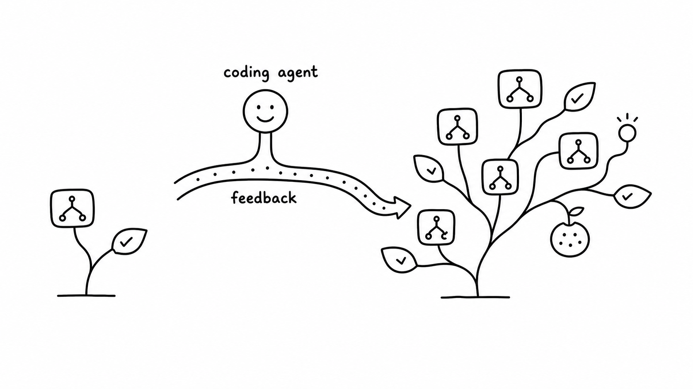
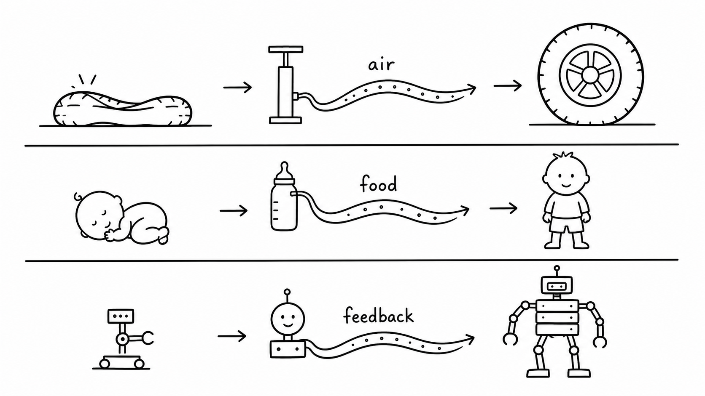
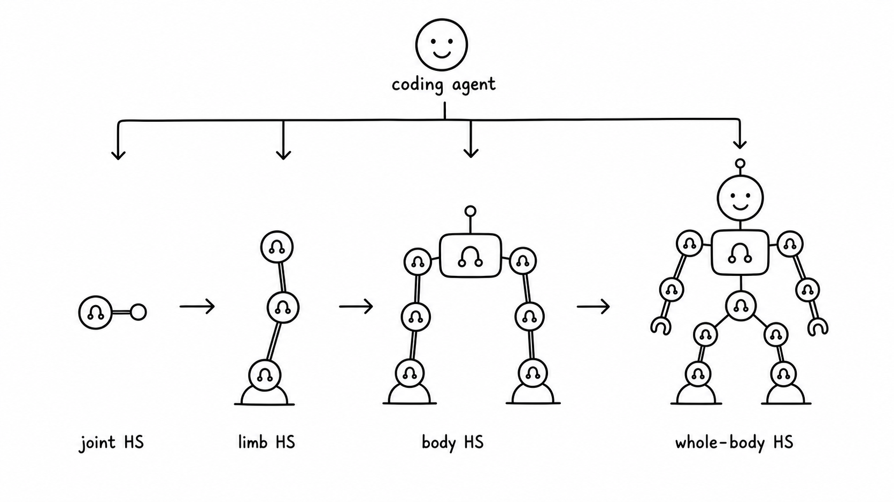

# Heuristic System: Software Evolves Through Metabolism

> Jiayi Weng



Heuristic roughly means "rule of thumb." It has a long history: rule systems, conditionals, search pruning, scheduling policies, and all kinds of human-written solutions have relied on heuristic algorithms. But after neural networks kicked off this wave of AI, many people instinctively started to feel that if a problem is complex enough, the right answer should eventually be a neural network. Neural networks seem smarter, more adaptive, more "intelligent." Heuristics started to look old-fashioned, like a practical trick from the previous era of software.

After these experiments, I am much less sure that intuition is right. Many heuristics did not fade because they were inherently dumb or capped at a low ceiling. Often, they lost because they were too expensive to maintain. Coding agents change more than the speed of writing code; they also change which code is worth owning for a long time. When writing and revising rules suddenly becomes cheaper, software structures that used to be too fine-grained, too annoying, or too dependent on failure history may become worth maintaining again.

My starting point was much smaller. I was trying to validate [EnvPool](https://github.com/sail-sg/envpool) environments. Random policies were too weak: in many environments, an entire episode never reached the important reward states. When a run failed, all I could see was a timeout or a score of 0, and it was hard to tell whether the environment was wrong, the wrapper was wrong, or the policy simply never reached an informative state. Training a neural network for every environment was also too heavy. Training scripts, dependencies, versions, and checkpoints would become a burden inside the test system itself.

So the question became:

```text
Can we write cheap, reproducible heuristics that are much stronger than random,
just to drive environments into informative states?
```

At first I asked Codex directly: "write a policy that solves Breakout." That did not work very well. A low score was not informative: Codex could not tell whether the action semantics were wrong, the state detector was wrong, the evaluation setup was wrong, or the policy structure itself was bad. Later I changed the task shape: do not just hand me a `policy.py`; maintain the whole loop.

The loop roughly looked like this:

```text
probe actions and observations
-> write state detectors
-> write the policy
-> run full episodes
-> record trials.jsonl and summary.csv
-> generate videos or curves
-> inspect failure modes
-> edit the policy
-> simplify code and add regressions
```

At the time, I did not have a name for this. I only felt that the task had changed shape. The final artifact had grown from a policy file into an experimental system that could keep being changed. It had probes, records, replays, failure modes, and clues for the next round.

## 1. Breakout: A Perfect Score Without Training

Breakout looks like a geometry problem at first: where is the ball, where is the paddle, and where will the ball land after it bounces off the walls? The real trouble comes later. A policy can keep catching the ball while no longer clearing bricks, and the score gets stuck in a stable loop.

Codex did not rush to write the final policy. It first checked the action space and observation shape, then found paddle, ball, and brick colors in RGB frames, and then used those image labels to scan the 128 RAM bytes, which you can roughly think of as the game's internal state. The early experiment ledger looked like this:

```text
trial_name                 score   cumulative_env_steps   note
shape_action_probe          -      32                     inspect obs/info/action
ram_byte_corr_probe_v1      -      5,032                  correlate RAM bytes
ram_fit_action_probe_v2     -      9,532                  action 2=right, 3=left
baseline_v0                99      16,303                 initial RAM intercept
tunnel0_v1                387      43,303                 no tunnel offset
```

`387` was the first local high score that could easily fool you. The policy could catch the ball reliably, but it was sending the ball into a cycle: it would not die, and it would not keep clearing bricks. If a human were hand-writing this, it would be tempting to keep tuning "catch accuracy." After watching the video and the last few dozen trajectory steps, Codex judged that the real problem was the lack of disturbance in the ball path.

<video controls src="heuristic_breakout_score387_tunnel0_render210x160.mp4" width="360"></video>

The first key mechanism was to break the loop. If no reward had appeared for a long time, add a periodic offset to the predicted landing point and knock the ball out of the local cycle. That moved the score from `387` to `507`.

```python
if steps_since_reward >= stuck_trigger_steps:
    phase = stuck_offset_index % 4
    if phase == 0:
        offset = +stuck_offset_px
    elif phase == 1:
        offset = -stuck_offset_px
    elif phase == 2:
        offset = +0.5 * stuck_offset_px
    else:
        offset = -0.5 * stuck_offset_px
else:
    offset = 0.0
```

Another failure mode came next: fast low balls. If the policy chased the normal intercept, the lookahead could pull the paddle too far away. Codex added `fast_low_ball_lead_steps=3`, and the score jumped from `507` to `839`.

```python
if vy > 0.1 and ball_y <= paddle_y:
    steps_to_paddle = max((paddle_y - ball_y) / vy, 0.0)
    intercept_x = reflect_position(ball_x + vx * steps_to_paddle)
    target_x = intercept_x + stuck_offset
elif vy >= fast_ball_min_vy:
    target_x = ball_x + fast_low_ball_lead_steps * vx
else:
    target_x = ball_x + chase_lead_steps * vx
```

The move from `839` to `864` felt most like tending a system that had already become complicated. Codex tried deadbands, serve offsets, stuck offsets, brick-balance bias, and lookahead steps. Many directions did not help. The useful change was a late-game condition: after the first wall had been cleared, the stuck offset should apply only while the ball was still far from the paddle; when the ball got close, the offset should decay away, otherwise the final bricks would pull the paddle off course. It also added a tiny paddle-drift compensation for the one-step delay between action and paddle position.

```python
if score >= 432 and stuck_release_horizon_steps > 0:
    release_ratio = clip(steps_to_paddle / stuck_release_horizon_steps, 0.0, 1.0)
    offset *= release_ratio

if score >= 432 and ball_y >= 170 and last_action == RIGHT:
    control_paddle_x = paddle_x + 2.0
elif score >= 432 and ball_y >= 170 and last_action == LEFT:
    control_paddle_x = paddle_x - 2.0
```

<video controls src="heuristic_breakout_ci3985ae2_score864_render210x160.mp4" width="360"></video>

The final default RAM configuration verified as `864 / 864 / 864` across three episodes. After that, Codex migrated the same geometric control back to pure image input: no RAM, only RGB segmentation for the paddle, ball, and brick balance. The pure-image version first reached `310`, then `428`, and finally reached `864` after lowering the late-game "decay the stuck offset" threshold so that it applied throughout the run. It first hit `864` after 7 policy-local episodes, corresponding to `14,504` policy-local environment steps in the figure.


This should not be described as "pure image reached the maximum score from scratch in 14.5K steps." The real sequence was: Codex first found geometric control, loop breaking, and late-stage offset decay in the RAM version; once that structure stabilized, it swapped the state-reading layer from RAM to RGB detection. The pure-image `14.5K` is a transfer budget.

What matters here is not just the score. `864` is the visible outcome, but the thing that transferred was a control structure that had been tended over time. The state-reading layer can be replaced, the control logic keeps working, and failure records keep constraining the next edit. Once a heuristic policy is written as maintainable software, it crosses the boundary of a one-off rule.

This was the first time I clearly felt that the agent was maintaining something larger than a policy. It had an input layer, a control layer, regression tests, failure history, and an entry point for the next update. It started to feel like a small software organ.

The full policy is in [`heuristic_breakout.py`](heuristic_breakout.py), and the experiment ledger is in [`heuristic_breakout_trials_summary.csv`](heuristic_breakout_trials_summary.csv).

## 2. Software Starts Metabolizing Feedback

After Breakout, I realized that the thing Codex was maintaining had grown from a heuristic program into a **heuristic system**.

By itself, "if the ball is on the left, move the paddle left" is only a heuristic. What turns it into a system is the machinery around it: how to detect the ball and paddle, how to confirm action semantics, how to notice that the ball path is stuck, how to reproduce a `387` or `864` score, how to record why a change worked, and where the next iteration should pick up.

The boundary is not rule count. It is whether feedback can enter the next run. A system that only executes fixed rules is still a heuristic program. Once historical results can rewrite the next state representation, action logic, evaluation method, or memory, it becomes the kind of heuristic system I mean here.

This is what I mean when I say software starts to have metabolism. The metaphor is simple: feedback no longer stops at human postmortems. An agent can digest it into changes in code, configuration, tests, and memory.

The relationship I want to express is very plain:



Air fills a tire. Food helps a child grow. A coding agent connects feedback into software's update path, so the software can slowly grow new structure.

The loop is roughly:

```text
observation -> state representation -> program policy -> action -> feedback -> memory -> update
```

A failing test can become a regression test. A log anomaly can become a new state detector. An experiment result can become a policy version. Human experience can become memory and the next patch. As long as these updates persist and affect the next run, the system starts absorbing feedback while it executes rules.

In this view, tests, logs, replays, patches, and memory also change position. They move one step beyond engineering support and begin to look like the entry points through which software absorbs feedback: failures enter through them, and updates persist through them.

Hold on to this intuition: the agent is tending a software system that grows more complex, keeps history, and remains editable. The hard question later will come from this: there is an upper bound to the complexity an agent can maintain, and that bound depends on feedback, tests, modularity, and tool quality.

## 3. Ant and HalfCheetah: Walking Without Training

Ant surprised me even more. Breakout still has fairly intuitive geometry. Ant is continuous control: 8 joint actions, and the failure modes quickly become body dynamics rather than "the ball was missed."

I did not start by saying "use CPG" or "use MPC." The request was only: do not train a neural network, make it reproducible locally, leave a record for every experiment, and keep improving the score. Codex first read the EnvPool/Gymnasium Ant observations and rewards, confirmed the action order, root velocity, torso orientation, joint positions, and joint velocities, and then proposed its first rhythmic gait.

The first version was a four-leg phase oscillator: left and right legs in opposite phase, hip and ankle joints tracking sinusoidal target angles, with actions produced by a PD controller. It was not elegant, but it was already much stronger than random: across 5 random seeds, the mean score was `2291`.

```python
leg_phase = warp_phase(phase + LEG_PHASE, stance_duty(vx))
stance = leg_phase < pi

hip_wave = HIP_BIAS + stance_or_swing_scale * (
    HIP_AMP * sin(leg_phase)
    + HIP_H2_AMP * sin(2 * leg_phase + HIP_H2_PHASE)
    + HIP_H3_AMP * sin(3 * leg_phase + HIP_H3_PHASE)
)

action[0::2] = KP * (
    HIP_SIGN * hip_wave
    + HEADING_AXIS * (YAW_GAIN * yaw + YAW_RATE_GAIN * yaw_rate)
    - q[0::2]
)
action[1::2] = KP * (ANKLE_SIGN * (ankle_wave + balance) - q[1::2])
```

The early iterations felt like tuning a real controller: add yaw feedback to reach `2718`, tune phase speed, hip and ankle amplitudes, and yaw-rate gain to reach `3025`, then add second- and third-order harmonics to reach `3162`. Codex also tried broad parameter search, but it did not consistently beat the current rhythmic policy, so it stopped expanding the search budget and moved to another representation.

The jump came from residual model predictive planning, or MPC in the code. Roughly speaking, MPC is "walking while thinking a short distance ahead": keep the rhythmic gait as a base reflex; at every real environment step, sample dozens of small residual action sequences inside a local MuJoCo model; score them; execute only the first residual action; then observe the next state and plan again. The unfinished tail of the previous plan becomes a warm start.

This way, the policy does not have to plan all 8 joints from scratch at every step. It starts from a stable gait and uses short-horizon model planning to correct it.

```python
base = cpg_action(phase, q, dq, roll, pitch, yaw, rates, contacts, vx)

best_plan = previous_plan.copy()
best_obj = rollout_objective(obs, best_plan)
for _ in range(CANDIDATES - 1):
    residuals = clip(
        best_plan + rng.normal(0.0, MPC_SIGMA, size=(HORIZON, 8)),
        -MPC_CLIP,
        MPC_CLIP,
    )
    residuals[1:] = 0.6 * residuals[1:] + 0.4 * residuals[:-1]
    obj = rollout_objective(obs, residuals)
    if obj > best_obj:
        best_obj = obj
        best_plan = residuals

plan[:-1] = PLAN_DECAY * best_plan[1:]
return clip(base + best_plan[0], -1.0, 1.0)
```

These structures grew through iteration. After the rhythmic policy reached `3162`, Codex wrote a model-based residual planner on its own. The first version, with horizon 6, 32 candidates, and small residuals, moved the score from `3135` to `3635`. Then it kept extending the controller:

```text
trial_name                               score_mean   cumulative_env_steps   note
ant_lr_cpgpd_v1                         2291.9       5,000                  left-right antiphase CPG + PD
ant_yawaxis_grid_v2                     2857.9       20,000                 yaw feedback + retuned params
ant_h3_428_v1                           3162.0       50,000                 second/third harmonics
ant_mpc_residual_v1_ep1                 3635.5       62,000                 horizon=6, candidates=32
ant_mpc_residual_cfg4_eval5             3964.7       67,000                 horizon=8, candidates=48
ant_mpc_residual_cand07_eval5           4647.1       73,000                 local search around MPC config
ant_mpc_residual_narrow04_eval5         4871.3       79,000                 lower z target, larger kp/candidates
ant_mpc_residual_warm02_eval5           5165.2       85,000                 warm-start residual plan
ant_mpc_fast065x060_sigma008_clip012    5759.4       95,000                 faster gait + larger residuals
ant_mpc_term001_ep1                     6054.5       100,000                terminal velocity cost
ant_mpc_default_adaptive_ep1            6146.2       106,300                adaptive phase speed + stance duty
```


<video controls src="heuristic_ant_mpc_default_6146_render480.mp4" width="480"></video>

The full experiment script is in [`heuristic_ant.py`](heuristic_ant.py), the extracted minimal policy is in [`heuristic_ant_min_policy.py`](heuristic_ant_min_policy.py), and the experiment ledger is in [`heuristic_ant_trials_summary.csv`](heuristic_ant_trials_summary.csv).

Ant gives a different signal from Breakout. Breakout shows that once the geometry is found, regularized input can produce extreme sample efficiency. Ant shows that complex policies can grow while staying inspectable, reproducible, and editable. By the end, the policy had oscillator phase, stance ratio, speed adaptation, roll/pitch/yaw feedback, foot contacts, short-horizon model rollouts, residual smoothing, terminal velocity cost, and warm-start plan decay. A human could certainly write one or two of those modules. Maintaining the experiment ledger, code, videos, and failed directions together in a short time is a very different level of difficulty.

So `6146` is only the surface number. The more important thing is that the agent preserved history, rejected bad directions, and attached new control structure to an old system. Many software systems grow complexity in exactly this way: start with a local structure that works, then use feedback to attach new layers.

HalfCheetah is another point in the same direction. I reran 5 episodes of `mpc-staged-tree-asym-pd-cpg`; seeds `100..104` produced mean `11836.7`, min `11735.0`, and max `12041.2`. The policy uses interpretable gait and posture rules plus online staged-tree MPC: first form a high-scoring gait with CPG/PD, then use short-horizon model scoring and a staged swing-amplitude schedule to correct actions. The script is [`heuristic_halfcheetah_v5.py`](heuristic_halfcheetah_v5.py), and the iteration log is [`heuristic_halfcheetah_v5_log.md`](heuristic_halfcheetah_v5_log.md).

I do not want to overstate this evidence. Continuous control is not going to move wholesale back to handwritten rules. But it does show something that used to be hard to imagine: a complex program policy can be modularized, recorded, regression-tested, and kept alive.

## 4. Atari57: Policies Can Grow Unattended

Breakout and Ant are single-task stories. With Atari57, I wanted to see what remained when the workflow left a single nice case. The setup was blunt: take the same Codex workflow, run it on the full Atari57 suite, use both `ram` and `native_obs` for each environment, and run 3 independent repeats for each input mode. In total:

```text
57 games x 2 input modes x 3 runs = 342 coding-agent search trajectories
```

There was no human giving hints in this experiment. I batch-launched `gpt-5.4 xhigh` agents through the Codex CLI. Each agent got the same template with a different `ENV_ID / OBS_MODE / REPEAT_INDEX`, then ran until it stopped. Each run had to write `policy.py`, `trials.jsonl`, `summary.csv`, `sample_efficiency.png`, and `README.md`.

The full prompt is in [`atari57_prompt_template.txt`](atari57_prompt_template.txt). The main constraints were:

```text
Goal: for one EnvPool Atari environment under the given OBS_MODE,
design and iterate a handwritten heuristic policy by yourself.

Hard constraints:
- Do not train neural networks.
- Do not read environment source, tests, ROM details, or hidden state.
- In native_obs mode, use only the obs returned by reset/step.
- In ram mode, info["ram"] is allowed.
- Atari initialization parameters are fixed, including frame_skip=1,
  reward_clip=False, and sticky action=0.
- Every probe/debug/trial step through the real environment must count
  toward cumulative_env_steps.

Outputs:
- policy.py: the current best heuristic, simplified as much as possible.
- trials.jsonl: score, environment steps, config, and notes for every trial.
- summary.csv: summary generated from trials.
- sample_efficiency.png: score curve by environment step and episode.
- README.md: best score, reproduction command, failed directions, stop reason.
```

In the figure below, the x-axis starts at `10^4` environment steps because the earlier region is almost flat. The y-axis is Atari human-normalized score, or HNS. The Codex curves use the common Atari median convention: for each game, take the median over 3 independent runs, then take the median across 57 games. This statistic is not dominated by a few very high-scoring games. It mainly measures coverage.


In the fully unattended batch run, `native_obs` reached `0.81` around `9.7M` steps, and `ram` reached `0.59`. In the same figure, the PPO2 / CleanRL EnvPool PPO median HNS curves saved by [OpenRL Benchmark](https://arxiv.org/abs/2402.03046) are roughly `0.88 / 0.92` at `10M` steps.

This compares environment interaction efficiency. The coding agent's time spent reading logs, writing code, and inspecting videos is not folded into the total compute cost.

This figure should be read narrowly. It supports one concrete signal: a rough coding-agent batch workflow, without inspecting intermediate results, can already push the Atari57 median into the neighborhood of these baselines. It does not support the claim that heuristics have broadly beaten reinforcement learning.

An aggregate curve compresses the distribution into one median, so I also plotted the 57 games individually. Raw Atari returns are not comparable across games, so the figure still uses each game's HNS. The dashed line at `1.0` marks human score.


The plot shows two things. First, there is overlap: in games such as Breakout, Krull, DoubleDunk, Boxing, and DemonAttack, both the heuristic and the reinforcement-learning baseline clearly exceed human score. Second, the differences are large: the heuristic is relatively stronger on Asterix, Jamesbond, Centipede, Bowling, Skiing, and Tennis; PPO is much stronger on Atlantis, VideoPinball, UpNDown, Assault, RoadRunner, and StarGunner.

This distribution is more informative than one median. The heuristic system did not uniformly learn "how to play Atari." In some games it quickly wrote down an effective mechanism. In others, it got stuck on state representation, long-term strategy, or environment-interface details.

What I find most interesting about Atari57 is that the source of sample efficiency changed. Traditional neural-network Atari learning has to relearn representation, credit assignment, and action semantics from high-dimensional input in every environment. Codex decomposes the environment into maintainable small software systems: aiming and dodging in shooters, bounces in paddle games, position rules in avoidance games, wrapper details, and each environment's own failed-experiment ledger. What remained at the end was a batch of generated, verified, and edited local heuristic policies. No general Atari policy network was trained in this process.

By this point, the game scores have moved into the background. The meaning of the `342` search trajectories is that the same workflow can already generate, verify, and edit local policies in batches; each environment leaves behind its own local mechanism, failure records, and reproducible policy. Software now has a sufficiently general maintainer that can write feedback back into code, tests, logs, and memory.

## 5. Counterexample: Montezuma

Some environments are a poor fit for ordinary reactive heuristics. Montezuma's Revenge is the clearest example.

In an earlier standalone Montezuma search, state-graph search reduced the key distance from `72` to `28`, but the reward was still `0`. Later, in the Atari57 pure-image batch, one unattended Codex run reached `400.0`: the repaired best replay was `repair_replay_r1_t19734`, seed `10001`, using `1769` environment steps. At heart, it was an open-loop route made of `86` macro-actions.

I included the recovered [policy](heuristic_montezuma_400_policy.py), [macro actions](heuristic_montezuma_400_macros.json), and [video](montezuma_400_render_seed10001_h264.mp4) in the repo.

<video controls src="montezuma_400_render_seed10001_h264.mp4" width="360"></video>

Montezuma exposes an expressivity problem. The ordinary `policy.py` state-machine format struggles with this kind of route: actions need precise timing, failures need recovery, and intermediate states need to re-enter the plan. Some environments need composable macro-actions, recoverable search state, and perhaps a program structure better suited to long-horizon planning than ordinary `if else`.

This kind of failure is valuable for a heuristic system. It tells us where the boundary is, and it suggests what the next abstraction might need to look like. A metabolic system still needs the right digestive structure; some feedback needs a new representation or a new program form before it can enter the system. Montezuma points toward the next system interface: macro-actions, recoverable state, search, and long-term memory. The counterexample gives the concept a boundary.

## 6. Heuristic System: From Policy to System

I used games because the feedback is clean and the scores are easy to measure. Once we look away from games, the closest example for most readers is the code repository.

### 6.1 Definition

At this point, "loop" is too vague. To move the idea from games into other software systems, we need to say what parts it has:

```text
HS = (O, Z, P, A, R, M, U)
```

`O / observation` is what the system can see: images, RAM, state vectors, logs, request features, code diffs, monitoring metrics, user feedback.

`Z / state` is the internal state representation: ball and paddle positions, robot posture, service load, PR risk regions, failure modes, caches, beliefs, or risk labels.

`P / policy or program` is the action logic: branches, thresholds, state machines, macro-actions, controllers, routing strategies, fallback strategies, or test-selection strategies.

`A / action` is what the system actually does in the outside world: Atari button presses, robot joint torques, a routing change, a selected test set, a code patch, a reply, or a memory write.

`R / feedback` is the evaluation signal: reward, test result, latency, error rate, cost, human label, online metric, replay score. It does not have to be a single scalar, but it needs to give updates a direction.

`M / memory` stores history: policy versions, configs, experiment results, failure reasons, replay material, rollback points. Without this layer, an agent can easily spin in circles after twenty rounds.

`U / update` uses `R` and `M` to modify `Z` and `P`; sometimes it also modifies the `A` interface, the `R` evaluation method, or the organization of `M`. The change has to persist: in code, config, tests, memory, or policy versions, affecting the next run. In this article, the coding agent is usually one implementation of `U`. Once it is connected, the boundary of the HS expands to include this update path; the executing policy code is only one part of it.

This does not guarantee every update makes the system better. The update process still needs regression or selection to filter out obviously worse changes. Without filtering, the system is only drifting.

### 6.2 Code Repository Maintenance

Experienced engineers use many heuristic judgments during code review:

```text
This diff touches auth, so the risk is high.
This test failure looks flaky; first check whether main is failing too.
This function is reused by several services, so its return semantics cannot change casually.
This change touches startup, so it may affect import time.
This PR is too large; split out the mechanical change first.
```

These judgments are not formal proofs, and they are not trained end to end. They come from engineering experience, and CI, production incidents, historical commits, review comments, and test coverage keep correcting them.

Using those seven parts, a code repository can be written as:

```text
O / observation = diff, CI logs, code index, historical incidents, metrics
Z / state       = risk regions, dependency graph, owners, failure modes, coverage
P / policy      = review rules, test selection, PR splitting, rollback strategy
A / action      = review comments, test runs, code patches, PR splits, rollbacks
R / feedback    = CI results, online metrics, review feedback, defect regression rate
M / memory      = PR history, failure records, decision reasons, fix paths
U / update      = coding agent edits check scripts, test strategy, docs, and code
```

In this view, a coding agent is doing much more than "help me write code." It is maintaining a repository's heuristic control system: which paths are risky, which tests are informative, which failures resemble historical problems, and which rules have gone stale.

This is also why a code repository is closer to everyday software than a game is. Software engineering has already prepared mature material for this kind of system: unit tests, integration tests, golden cases, regression tests, lint, type checks, CI, and performance baselines. These are quality checks, and they also establish protocols for the codebase. A protocol says what a function promises to the outside world, which old bugs must not recur, where a library boundary sits, and which tests must run after certain paths change.

Once the protocol is complete enough, the internal implementation can be replaced more boldly. For example, as long as a parser continues to pass golden syntax cases and error-recovery tests, it matters less whether the inside is handwritten recursive descent, a parser generator, or a state machine refactored by an agent. What matters is whether the boundary covers downstream behavior.

Tests, lint, and CI are still not enough by themselves. They begin to look like the HS in this article when a coding agent can use failure records and historical experience to modify tests, check scripts, risk labels, and PR-splitting strategies. Agents are strongest under clear feedback. The more tests behave like executable protocols, the more an agent can search inside the boundary. Conversely, if the tests are bad, the agent will exploit the holes faster and push the system toward a wrong local optimum. A bad test is a bad reward signal wearing software-engineering clothes.

The real reversal is in the standard for which code is worth owning:

```text
Coding agents change the speed of writing code.
They also change which code is worth owning for a long time.
```

Many rule layers used to be "not worth writing." The blocker was often maintenance: after the rules were written, nobody wanted to keep them alive. With coding agents, some local rules that used to be too fine-grained, too annoying, or too dependent on failure history may become worth owning again. Tests, logs, patches, and memory can move from engineering support toward software's learning organs.

### 6.3 Software That Already Lives on Heuristics

Outside code repositories, there is another large class of systems that already live on heuristics: systems where the global optimum is too expensive to find cheaply.

Scheduling systems are like this. Cluster scheduling, job queues, GPU allocation, and Kubernetes placement all have to trade off priority, fairness, data locality, preemption, cold start, retry behavior, and tail latency. Combinatorial optimization is similar: vehicle routing, bin packing, rostering, warehouse picking, and ad-budget allocation all have exploding search spaces, so the final system inevitably grows greedy rules, local search, beam search, repair heuristics, and pruning rules.

Traffic splitting and staged rollout are also more complicated than turning `1%` into `10%`. A real strategy has to watch latency, error rate, capacity, cost, user consistency, and rollback risk at the same time. Database query planners and compiler optimizers are old-school heuristic systems too: join order, index selection, inlining thresholds, loop unrolling, and pass ordering are all built on cost models, thresholds, pruning, and regression benchmarks.

These systems share one property: heuristics are already on the critical path, but they are expensive to maintain. A slow-query fix might become a new join-cost rule and a regression benchmark. A threshold that works well under today's traffic can start oscillating next month when the distribution shifts. A pile of local patches can sit around for years, with nobody daring to delete or edit them.

The HS view is interesting here because failed jobs, slow queries, rollout incidents, benchmark regressions, scheduling replays, and production logs can all become update material. A coding agent can read failed samples, edit scoring functions, fallback strategies, pruning rules, test sets, and replay scripts, then write effective experience back into policies and docs. In the past, these heuristics had to be hand-maintained by a small group of experts. Now they may become software systems that continuously absorb feedback.

### 6.4 Robotics

Ant naturally suggests robotics, but this is also where it is easiest to overclaim.

In simulation, Codex can try tens of thousands or millions of steps; falling over just means reset. In the real world, every failure costs time, hardware wear, safety margin, scene reset, and sensor drift. So this loop cannot be moved directly onto a physical robot, and it definitely cannot run blindly the way it does in simulation.

I prefer to think of it as a **hierarchical HS**: a set of small loops arranged in layers. Low layers handle local safety and low-latency control. Middle layers handle limb coordination and contact. Higher layers handle tasks, recovery, and long-term memory.

```text
joint-level HS -> limb-level HS -> whole-body balance HS -> task-level HS
```

One joint can be an HS; several joints can compose a limb HS; limbs can compose body and whole-body HS.



A joint-level HS sees encoders, torque, current, IMU, and contact sensors; turns them into errors, velocities, loads, and danger flags; then outputs target positions, target velocities, or torque commands. Its feedback is overload, slip, energy use, and safety violations. Updates mainly change gains, thresholds, protection rules, and tests. These updates must be conservative. An agent should not casually rewrite safety boundaries on a physical robot.

Limb-level and whole-body HS can handle gait, contact strategy, fall recovery, posture, and energy use. Task-level HS sits above that and handles longer flows such as "approach the cup, adjust the gripper, then recover from failure." In this view, a robot is better understood as many local HS connected through a hierarchy. A pile of isolated "HS joints" would not reach this level.

The most imaginative version looks like this: after a new robot powers on, a coding agent connects to simulation, logs, video, sensor streams, and regression tests. It first lets joint-level HS find stable behavior inside safety boundaries, then lets limb-level HS grow coordination, then lets whole-body HS grow standing, recovery, and balance, and only later moves toward task-level actions. The agent is like an update pipeline plugged into the system: it continuously feeds electricity, compute, tokens, failure videos, and test results into the system, then rewrites feedback into code, parameters, safety rules, and memory. Evolution happens inside: each layer's state representation, control policy, and recovery actions slowly reshape themselves until they better fit this particular body.

If that path works, a process that once looked like an infant spending months learning to stand, walk, and recover from falls might one day be compressed by simulation, replay, and agent maintenance into an hour of software metabolism. The central actor in that picture is a hierarchical heuristic system being fed feedback, filtering out bad mutations, and solidifying good motions. A big model directly "knowing how to walk" is only a small corner of the picture. Here, "metabolism" means feedback is digested into system changes; "evolution" means the system itself grows into a more suitable form through those changes.

Manipulation tasks are much harder. Folding clothes, organizing cables, or opening soft packaging is not just about how robot joints move. The object state itself matters: cloth deformation, occlusion, contact history, friction, wrinkles, target shape. Tuning a few joint phases will not solve that. Without good perceptual representations, recoverable action primitives, and sufficiently realistic simulation, a coding agent will write brittle rules on top of the wrong state variables.

The realistic form is probably a hybrid system: simulation and offline data generate and filter candidate heuristics; the real robot only runs small, safe, guarded validations; neural networks handle perception, object-state estimation, and long-horizon value; hierarchical HS handles low-latency reflexes, safety constraints, local recovery, task decomposition, and test criteria; coding agents maintain interfaces, detectors, failure handling, and regression tests.

Framed this way, the point shifts away from "handwrite cloth folding with heuristics" and toward pulling local regularities that can be written as programs out of end-to-end training.

### 6.5 Continual Learning and Coupling Complexity

At this point, the real research question shifts from "can heuristics be written" to "how complex can an HS get while still remaining maintainable?"

In machine-learning terms, the closest concept may be continual learning. Online learning is more about whether updates happen as data arrives; continual learning is more about how a system keeps updating over time without forgetting old abilities. HS adds another layer: after new feedback arrives, the writable surface can expand beyond parameters to state detectors, thresholds, macro-actions, tests, log parsers, memory organization, and even the procedure for collecting the next round of feedback. As long as those changes persist and affect the next run, the software is learning continuously.

This makes "not forgetting" more concrete. Neural-network continual learning worries about catastrophic forgetting. HS can forget too, but the failure mode looks more like software engineering: a new rule fixes one failure mode while breaking an old scenario; a memory keeps steering the agent in a wrong direction; a patch silently changes a boundary that tests did not cover. Regression tests, fixed replays, experiment records, version diffs, and simplification passes are the anti-forgetting mechanisms of HS. They let feedback accumulate, so the next round does not have to start again from intuition.

So the sharper question is: if we can characterize the complexity of a heuristic, we can ask how complex an HS an agent can actually maintain. I currently prefer to call this quantity **coupling complexity**: how many mutually entangled states, rules, tests, feedback channels, and pieces of history a single update has to respect. Lines of code and rule counts are only the surface. What consumes context is the size of the interaction surface.

Looking toward code, coupling complexity is constrained by module boundaries, interface stability, test coverage, fixed replays, log observability, feedback latency, rollback cost, and state reproducibility. Good modularity cuts global coupling into local coupling. Good tests keep the agent from having to simulate the whole system in its head every time.

Looking toward the coding agent, how much coupling complexity it can hold depends on model capability, context length, memory quality, tool quality, and experiment speed. Stronger models can handle more interactions at once. Longer context loses fewer clues. Memory preserves experience across rounds. Search, execution, localization, and replay tools move part of the cognitive load outside the model. If any one of these is weak, the ceiling on maintainable coupling complexity drops.

Put the two sides together, and we get a set of research hypotheses:

```text
Clearer feedback increases the coupling complexity that each unit of agent intelligence can maintain.
Given the same tools and feedback, stronger models can handle higher coupling complexity.
Modularity, tests, and replay move part of coupling complexity into the environment.
Memory and tools increase the agent's effective context.
An HS that only grows and never compresses will keep increasing coupling complexity
until it exceeds maintainability.
```

This also explains why HS sits so close to old software-engineering philosophy. Modularity matters because it lowers coupling complexity. Tests turn final acceptance into executable feedback. Tests, replays, CI, and benchmarks are feedback channels. Logs, traces, and replays are software's senses: without them, failures cannot enter the system, so metabolism cannot happen. Refactoring compresses learning history by folding a pile of local patches back into a simpler representation. Technical debt is uncompressed feedback residue: each failure gets patched into a new rule. That may work in the short term, but over time coupling complexity explodes.

Breakout reached `864` partly because the rules were simple, and partly because failures could be replayed on video, locally reproduced, and regression-checked. Ant is much more complex, but its structure is layered, feedback is dense, and the policy can be split into rhythm, posture, contact, and residual planning. Montezuma points at another boundary: long-horizon timing, recoverable state, and macro-action composition quickly push coupling complexity so high that ordinary `policy.py` is not enough.

This may be the quantity most worth studying for HS: given a model, context, memory, tools, test protocol, and feedback quality, how much coupling complexity can a system stably carry? If we can measure that curve, maintenance cost stops being only a metaphor and becomes something we can compare.

## 7. Limitations

First, the results depend on the current agent capability. This article mainly discusses Codex 5.4 `xhigh`. Different models, reasoning budgets, tools, and prompts may change the distribution. This is a report of a phenomenon, not a full benchmark.

Second, the single-task experiments had a human in the loop. Breakout and Ant were not fully automated benchmarks; I looked at results and decided where to let Codex continue. Atari57 is the unattended batch run. Mixing these two kinds of evidence would blur the conclusion.

Third, compute comparisons require care. Codex's compute for writing code, reading logs, and watching videos is not counted as neural-network training compute. MPC in Ant and HalfCheetah also performs local model rollouts. The environment-step numbers mainly show that real environment interaction is low; they do not mean total compute is cheap.

Fourth, being updateable does not mean automatically improving. An agent-generated heuristic system can become more and more complicated until it turns into unmaintainable code. Experiment ledgers, regression tests, and simplification passes are not optional. They are the main mechanisms that keep the system from collapsing.

Fifth, this should not be framed as a replacement for reinforcement learning. Neural networks still have clear advantages in complex vision, cross-state generalization, and long-horizon value estimation. The reasonable direction is still composition: neural networks handle perception, generalization, and long-horizon strategy; heuristic systems handle local reflexes, safety constraints, fallback strategies, test criteria, and interpretable debugging.

These limits put the idea back where it actually applies. For software to have metabolism, it cannot rewrite itself freely. It needs tests, permissions, rollback, interpretable records, human review, and sandboxes. Without those, metabolism turns into uncontrolled growth.

## 8. Conclusion

This article started from a small testing need: can we write cheap, reproducible policies that are much stronger than random, so environments can be driven into informative states? By the end, the scores have moved into the background. What remains is another way to look at software: when a coding agent can continuously read failures, edit code, add tests, write records, and run regressions, a heuristic policy can become a software system that can be cared for.

Breakout gives the clearest starting point. The path `387 -> 507 -> 839 -> 864` came from an experiment loop that kept absorbing failures: action semantics, state detection, stuck ball paths, low fast balls, late-game offset release, paddle-drift compensation. Each step was pinned down by video, logs, and regression tests. Ant and HalfCheetah show that complexity can also be maintained. Atari57 shows that the workflow can run in batch. Montezuma reminds us that long-horizon timing and recoverable state quickly raise coupling complexity.

The judgment this article wants to preserve is: many heuristics looked hopeless because the maintenance cost was too high. Nobody wanted to care for hundreds of local rules, failure records, test boundaries, and state representations over the long run. Coding agents change that maintenance-cost curve. Rules, tests, logs, memory, and patches used to be scattered engineering materials. Now they can start to form a heuristic system that keeps updating.

This also gives continual learning a different software form. Learning can happen outside parameters: when new feedback enters a system and rewrites state detectors, tests, macro-actions, memory, log parsers, and the next policy, the software itself is learning. Old software-engineering principles gain new meaning here: modularity lowers coupling complexity, tests provide feedback, logs and replays make failures visible, and refactoring compresses history.

The next quantity worth measuring is how much coupling complexity an HS can stably carry under a given model, context, memory, toolset, test protocol, and feedback quality. If that quantity can be measured, "maintenance cost" becomes more than intuition. It becomes an object we can compare, and it can explain why some systems are suitable for long-term agent maintenance while others quickly turn into a big ball of mud.

In the past, writing software mostly meant writing how it runs now. Increasingly, we will also write how it absorbs future feedback, compresses history, and grows new behavior.

## Disclaimer

This article represents only my personal views. It does not represent any company position, and the discussion here is unrelated to any specific company project, product plan, or internal work.

## Acknowledgements

Thanks to [Costa Huang](https://costa.sh/) and [Tairan He](https://tairanhe.com/) for feedback.

## Citation

If you need to cite this article in LaTeX, you can use the BibTeX below.

```bibtex
@misc{weng2026heuristic_system,
  title = {Heuristic System: Software Evolves Through Metabolism},
  author = {Weng, Jiayi},
  year = {2026},
  month = may,
  howpublished = {\url{https://trinkle23897.github.io/heuristic-system/}},
  note = {Blog post}
}
```

## Appendix: Reproducing Five Representative Results

The full artifact repository is [https://github.com/Trinkle23897/heuristic-system](https://github.com/Trinkle23897/heuristic-system). The commands below assume you have cloned that repo and are running them from the repository root. The GitHub Pages site only serves the article and the static files it references; the full scripts, CSVs, videos, and experiment artifacts live in the repo.

### A.1 Pong 21

```bash
python heuristic_pong.py \
  --policy ram \
  --episodes 1 \
  --seed 0
```

The current Gym version prints a maintenance warning first. The useful output is:

```text
episode=0 score=21.0
summary: episodes=1 mean=21.000 min=21.0 max=21.0
```

### A.2 Breakout 864

```bash
rm -f /tmp/repro_breakout_864.jsonl /tmp/repro_breakout_864.csv
python heuristic_breakout.py \
  --policy ram \
  --episodes 1 \
  --seed 0 \
  --max-steps 108000 \
  --deadband 3 \
  --chase-lead-steps 6 \
  --tunnel-offset 0 \
  --launch-offset 24 \
  --fast-ball-min-vy 3 \
  --fast-low-ball-lead-steps 3 \
  --stuck-trigger-steps 1024 \
  --stuck-switch-steps 256 \
  --stuck-offset 12 \
  --stuck-release-horizon-steps 8 \
  --brick-balance-deadzone 0.01 \
  --brick-balance-bias-min-score 432 \
  --late-game-paddle-lag-px 2 \
  --late-game-lag-ball-y 170 \
  --trial-name repro_breakout_864 \
  --log-path /tmp/repro_breakout_864.jsonl \
  --summary-path /tmp/repro_breakout_864.csv
```

The expected output should include `score=864.0` and `mean=864.000`.

### A.3 Ant Default MPC Policy

The command below reproduces the final default MPC policy. It is much slower than Breakout because each real environment step evaluates `96 x 10` candidate residual actions inside a local MuJoCo model.

```bash
rm -f /tmp/repro_ant_6146_eval5.jsonl /tmp/repro_ant_6146_eval5.csv
python heuristic_ant.py \
  --policy mpc \
  --episodes 5 \
  --seed 0 \
  --max-steps 1000 \
  --mujoco-xml-path ant_envpool.xml \
  --trial-name repro_ant_6146_eval5 \
  --log-path /tmp/repro_ant_6146_eval5.jsonl \
  --summary-path /tmp/repro_ant_6146_eval5.csv
```

The expected output should include `mean=6005.521`, `min=5776.805`, and `max=6146.208`. My local rerun printed:

```text
episode=0 score=6146.208 x_position=285.434
episode=1 score=5982.507 x_position=277.088
episode=2 score=6028.890 x_position=279.226
episode=3 score=5776.805 x_position=267.084
episode=4 score=6093.194 x_position=282.733
eval_summary: episodes=5 env_steps=5000 mean=6005.521 min=5776.805 max=6146.208 x_mean=278.313 x_max=285.434
```

### A.4 HalfCheetah Staged-Tree MPC 5-Episode Recheck

The command below reproduces the 5-episode evaluation on the checked-in script path. It is noticeably slower than a normal rollout because each real environment step performs online model scoring.

```bash
python heuristic_halfcheetah_v5.py \
  --policy mpc-staged-tree-asym-pd-cpg \
  --eval-episodes 5 \
  --eval-seed 100
```

My local rerun printed:

```json
{
  "episodes": 5,
  "frames": 5000,
  "max_return": 12041.189857475818,
  "mean_return": 11836.693449819431,
  "min_return": 11735.02927325886,
  "policy": "mpc-staged-tree-asym-pd-cpg",
  "returns": [
    12041.189857475818,
    11735.02927325886,
    11854.710591778263,
    11767.164473961016,
    11785.373052623192
  ],
  "std_return": 109.49617764723155
}
```

### A.5 Montezuma 400 Replay

The command below reproduces the `400`-point open-loop route recovered from the Atari57 batch run. The route is a replay made of `86` macro-actions with very limited general reactive ability, which is why the main text treats it as a boundary case.

```bash
python heuristic_montezuma_400_policy.py \
  --metadata-out /tmp/repro_montezuma_400.json
```

The current Gym version prints a maintenance warning first. The useful output is:

```json
{
  "env_id": "MontezumaRevenge-v5",
  "seed": 10001,
  "score": 400.0,
  "env_steps": 1769,
  "done": true,
  "macro_count": 86,
  "scripted_action_steps": 1793,
  "expected_score": 400.0,
  "expected_steps": 1769,
  "record_mp4": null,
  "frame0_png": null
}
```
